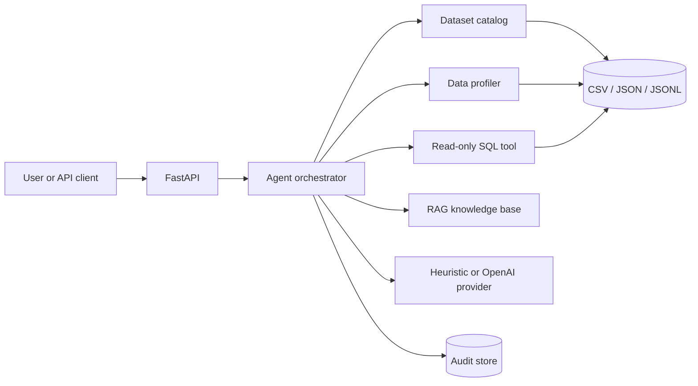

# Agentic DataOps Platform

> An auditable agentic platform for dataset profiling, read-only SQL, data-quality checks, and RAG-grounded analysis.

## Why this project

The platform turns a natural-language data question into a controlled workflow. The agent can inspect datasets, profile quality, search data contracts, execute read-only SQL, and produce an auditable answer.



## Core capabilities

- Dataset catalog for CSV, JSON, and JSONL files.
- Column-level profiling: types, nulls, cardinality, samples, and numeric statistics.
- Data-quality issues with severity, rule, message, and affected column.
- SQL guardrails that allow only one `SELECT` or `WITH` statement.
- Query execution with row limits, timeouts, and audit events.
- Lexical RAG over data contracts and quality documentation.
- Offline deterministic agent for demos and tests.
- Optional OpenAI Responses API tool-calling adapter.
- FastAPI endpoints, CLI, Docker, SQLite audit trail, and pytest coverage.

## Quickstart

```bash
git clone https://github.com/matteospata/agentic-dataops.git
cd agentic-dataops
python -m venv .venv
source .venv/bin/activate
pip install -e '.[dev]'
cp .env.example .env
python -m agentic_dataops.cli datasets
python -m agentic_dataops.cli profile --dataset sales_demo.csv
python -m agentic_dataops.cli ask --dataset sales_demo.csv "Compare revenue by region and check data quality."
```

Start the API:

```bash
uvicorn agentic_dataops.api:app --reload
curl -X POST http://localhost:8000/agent/tasks \
  -H 'Content-Type: application/json' \
  -d '{"dataset":"sales_demo.csv","question":"Compare revenue by region and check data quality."}'
```

Or run with Docker:

```bash
docker compose up --build
```

## API

| Method | Endpoint | Purpose |
|---|---|---|
| `GET` | `/health` | service and provider status |
| `GET` | `/datasets` | list available datasets |
| `GET` | `/datasets/{dataset}/profile` | profile a dataset |
| `POST` | `/agent/tasks` | run an agent task |
| `GET` | `/agent/runs/{run_id}` | retrieve an audited run |

## Safety model

The LLM never receives direct database access. It can request named tools, and each tool enforces its own policy:

- SQL accepts only `SELECT` and `WITH` statements.
- Mutation keywords such as `DROP`, `DELETE`, `UPDATE`, and `INSERT` are rejected.
- Results are capped by `AGENTIC_MAX_RESULT_ROWS`.
- Long-running queries are interrupted by a progress handler.
- Every tool invocation is persisted with arguments, result, status, and timestamp.
- The project is designed for human approval before adding future write-capable tools.

## Agent providers

The default provider is deterministic and requires no API key:

```dotenv
AGENTIC_AGENT_PROVIDER=heuristic
```

To enable the OpenAI tool-calling adapter:

```bash
pip install -e '.[llm]'
```

Then set:

```dotenv
AGENTIC_AGENT_PROVIDER=openai
AGENTIC_LLM_MODEL=gpt-4o-mini
OPENAI_API_KEY=your_key_here
```

The provider adapter keeps the local tools and SQL guardrails in control of execution.

## Repository layout

```text
src/agentic_dataops/
├── agents/          # provider adapters and orchestration
├── api.py            # FastAPI application
├── policies/        # SQL and tool safety policies
├── storage/          # audit persistence
├── tools/            # catalog, profiling, SQL, and RAG tools
├── cli.py            # command-line interface
├── config.py         # typed environment configuration
└── schemas.py        # data contracts
```

## Testing

```bash
make test
make lint
```

The tests cover SQL mutation rejection, profiling issues, aggregate execution, agent orchestration, citations, and audit persistence. They run without network access or API credentials.

## Production roadmap

1. Replace SQLite execution with DuckDB or PostgreSQL/pgvector.
2. Add Parquet ingestion and object storage.
3. Add schema drift and data lineage.
4. Add human approval for write-capable tools.
5. Add OpenTelemetry traces and cost tracking.
6. Add a golden-task evaluation set for SQL correctness, tool selection, answer quality, and latency.
7. Expose the tools through MCP with explicit permissions.


## License

MIT.

